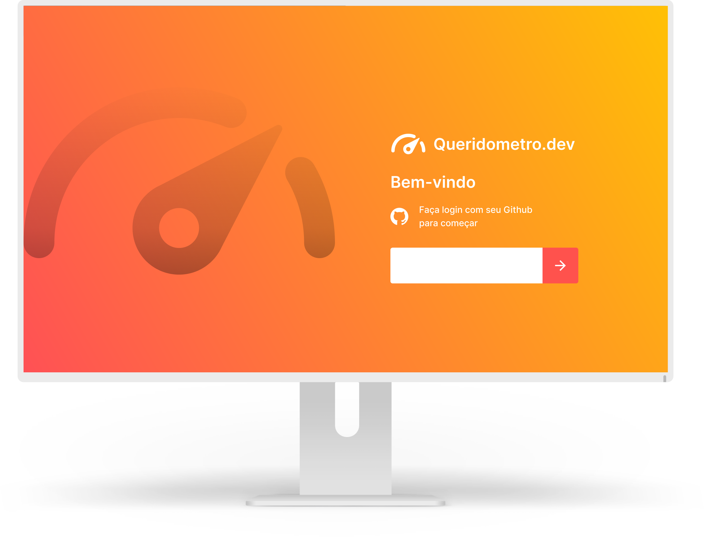

<p align="center"> 
    <a href="https://queridometro-dev.vercel.app">
        
        <br />Queridômetro.dev
    </a>
</p>

----



# Indice

- [Sobre](#-sobre)
- [Tecnologias](#Tecnologias)
- [Regras de negócio](#Regras-de-negocio)
- [Como baixar o projeto](#-como-baixar-o-projeto)

## 🔖&nbsp; Sobre

Projeto desenvolvido com o intuito de verificar o aspecto social de um grupo de desenvolvedores. Inspiração do projeto surgiu de duas partes. A primeira, e mais evidente, é o Big Brother Brasil 21 onde temos a temática do Queridômetro onde os participantes avaliam uns aos outros, e neste ponto, o layout se inspirou nisso. O outro aspecto foi de que existem muitas ferramentas de avaliação social de equipes e então resolvi propor esta para devs ultilizando a API do Github para fornecer dados básicos. 

### Disponível em [https://queridometro-dev.vercel.app](https://queridometro-dev.vercel.app)

## Objetivo
 Ampliar meus conhecimentos em NextJS e Cookies.

---
## Tecnologias

Esse projeto foi desenvolvido com as seguintes tecnologias:

- [Node.js](https://nodejs.org/en/)
- [React](https://reactjs.org)
- [NextJS](https://nextjs.org/)

---

## Regras de negócio

 - Quando o usuario "Logar" com o Github, adicionar na listagem de participantes da votação.
 - Para não criar uma pagina pra cadastrar os participantes, foi que todos os participantes da votação entram primeiramente na página sem realizar a votação e saiam para que o proximo entre.
 - Ao iniciar a votação, deve ser seguida até o final.
 - Os dados são salvos em Cookies.
 - O primeiro usuario se torna o "Líder" e pode definir se a votação vai ser aberta ou fechada.
 - Após realizarem a votação, os participantes podem ver os resultados de todos na página de resultado
 - Caso o voto seja aberto o participante pode selecionar o card que deseja e ver quem votou nesta pessoa e o valor do seu voto.
 - Os dados ficam salvos apenas por 1 dia, para que a dinâmica seja feita apenas uma vez por dia.
 - Após realizarem a votação não será possivel votar novamente no mesmo dia.

---

## 🗂 Como baixar o projeto

```bash

    # Clonar o repositório
    $ git clone https://github.com/filipeleonelbatista/queridometro-dev.git

    # Entrar no diretório desejado
    $ cd queridometro-dev

    # Instalar as dependências
    $ yarn install

    # Iniciar o projeto
    $ yarn dev
```

---

<h3 align="center" >Vamos nos conectar 😉</h3>
<p align="center">
  <a href="https://www.linkedin.com/in/filipelbatista/">
    
  </a>&ensp;
  <a href="mailto:filipe.x2016@gmail.com">
    
  </a>&ensp;
  <a href="https://instagram.com/filipegaucho22">
    
  </a>
</p>
<br />
<p align="center">
    Desenvolvido 💜 por Filipe Batista 
</p>
